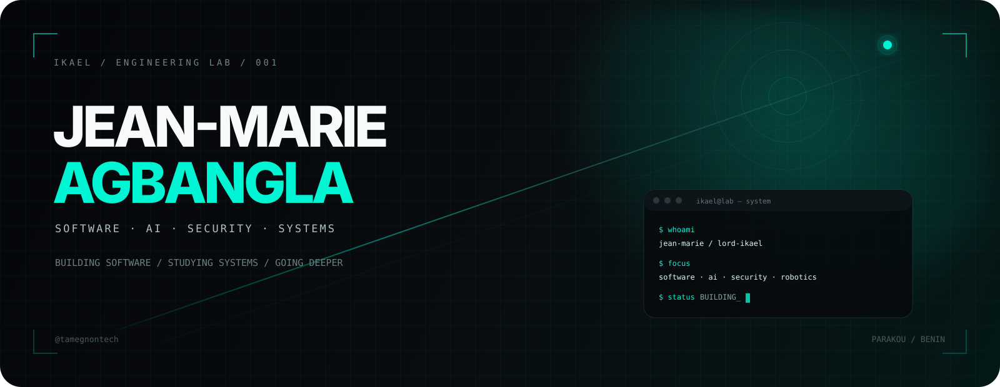
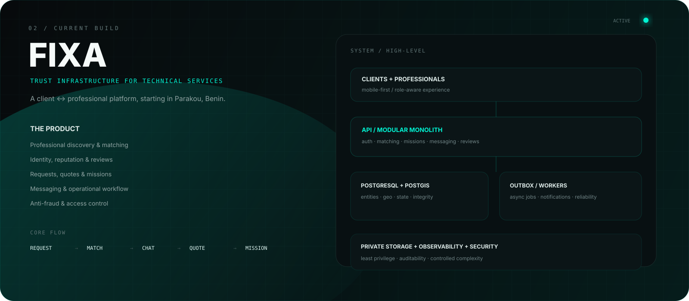

<div align="center">
  
</div>

<br>

<div align="center">

[](https://github.com/tamegnontech)
[](mailto:tamegnontech@gmail.com)
[](https://github.com/tamegnontech)

</div>

---

## / 00 — THE OPERATOR

I'm **Jean-Marie AGBANGLA** — `Lord Ikael` online.

Electrotechnics student. Software developer. Curious about the parts of a system that most people never see.

I build software, study how systems behave, and use that knowledge to make the next version better.

My interests converge around four domains:

**SOFTWARE ENGINEERING** · **ARTIFICIAL INTELLIGENCE** · **CYBERSECURITY** · **ROBOTICS**

The common thread is simple: **understand the system, not just the interface.**

---

## / 01 — NOW BUILDING

<div align="center">
  
</div>

### FIXA

**FIXA** is a client ↔ professional platform for technical services, starting in **Parakou, Benin**.

The product is being designed around a real operational workflow rather than a directory of phone numbers:

`REQUEST` → `MATCHING` → `CONVERSATION` → `QUOTE` → `MISSION` → `REVIEW`

The engineering challenge is the interesting part: identity, trust, permissions, location, reputation, messaging, mission state, payment declaration, anti-fraud controls and reliable data flows all have to coexist without turning the MVP into an unnecessarily complex distributed system.

**Current architecture:** mobile-first PWA · modular monolith · REST API · PostgreSQL/PostGIS · private storage · outbox/worker pattern

---

## / 02 — STACK

### CORE

`TypeScript` `JavaScript` `Python` `HTML` `CSS`

### WEB

`React` `Vite` `PWA` `Responsive UI`

### BACKEND

`Node.js` `Fastify` `REST` `OpenAPI`

### DATA

`PostgreSQL` `PostGIS` `Prisma`

### DEV ENVIRONMENT

`Fedora Linux` `Bash` `Git` `GitHub` `Docker` `GitHub Actions`

### EXPLORATION

`Machine Learning` `Data Science` `AI Agents` `Web Security` `Pentesting` `Robotics`

---

## / 03 — SYSTEMS

I care about what happens **between** the pieces.

```text
CLIENT
  ↓
UI / PWA
  ↓
API
  ↓
APPLICATION LOGIC
  ↓
DATA / EVENTS / STORAGE
  ↓
OBSERVABILITY
```

When I design a feature, I naturally ask:

- Where does the data live?
- Who can change it?
- What happens when a request fails halfway through?
- What happens when two actions race each other?
- What can be abused?
- What should be logged?
- What should never be exposed?

That mindset is pushing me from **building pages** toward **designing systems**.

---

## / 04 — SECURITY

Security is an engineering concern, not a final checkbox.

### OFFENSIVE

`Web Application Security` · `Penetration Testing` · `Vulnerability Research` · `Network Security` · `Red Teaming`

### DEFENSIVE

`Authentication` · `Authorization` · `RBAC` · `Threat Modeling` · `Secure Development` · `Logging & Auditing`

My long-term direction is to become strong enough to look at the same system from both perspectives:

> **How would I build it?**  
> **How would I attack it?**  
> **How would I harden it?**

---

## / 05 — AI / DATA

I am interested in AI where it meets engineering rather than hype.

```text
DATA → PROCESSING → MODELS → DECISION → PRODUCT
```

I'm exploring **machine learning, data science, recommendation systems, NLP, AI agents and AI-assisted engineering**.

The goal is not just to call a model. It is to understand how intelligent capabilities become reliable product features.

---

## / 06 — ROBOTICS / HARDWARE

Electrotechnics gives me another way to think about systems: software can be only one component of the machine.

I'm exploring the intersection of:

`Electronics` + `Embedded Systems` + `Control` + `Automation` + `Software` + `AI`

That path eventually leads toward intelligent machines rather than software that only lives on a screen.

---

## / 07 — LINUX

**Fedora Linux** is my primary development environment.

The terminal is part of the learning process: filesystem, permissions, processes, packages, Git workflows, scripting and CLI tooling all matter because they expose what the system is actually doing.

```bash
$ whoami
ikael

$ uname -s
Linux

$ echo "keep building"
keep building
```

---

## / 08 — BUILD LOG

This profile is a record of things I actually build, test, break and improve.

### FEATURED

**[FIXA](https://github.com/tamegnontech)**  
Client ↔ professional infrastructure for technical services.

**[Explore all repositories →](https://github.com/tamegnontech?tab=repositories)**

> I would rather have a few repositories with real engineering behind them than dozens of tutorial clones.

---

## / 09 — GITHUB SIGNAL

<div align="center">

<a href="https://github.com/tamegnontech">
  
</a>

</div>

The numbers are secondary. **The repositories are the signal.**

---

## / 10 — DIRECTION

```text
SOFTWARE ENGINEERING
        ↓
FULL-STACK SYSTEMS
        ↓
DATA + AI
        ↓
SECURITY
        ↓
INTELLIGENT SYSTEMS
        ↓
ROBOTICS
```

Long term, I want to become a **Software / AI Engineer with deep security knowledge**, while keeping one foot in data and another in hardware.

Not because the titles sound impressive.

Because those disciplines force me to understand systems from different angles.

---

## / 11 — CONTACT

**Jean-Marie AGBANGLA**  
`Lord Ikael` · `@tamegnontech`

📧 [tamegnontech@gmail.com](mailto:tamegnontech@gmail.com)  
🐙 [github.com/tamegnontech](https://github.com/tamegnontech)

<div align="center">
  
</div>
